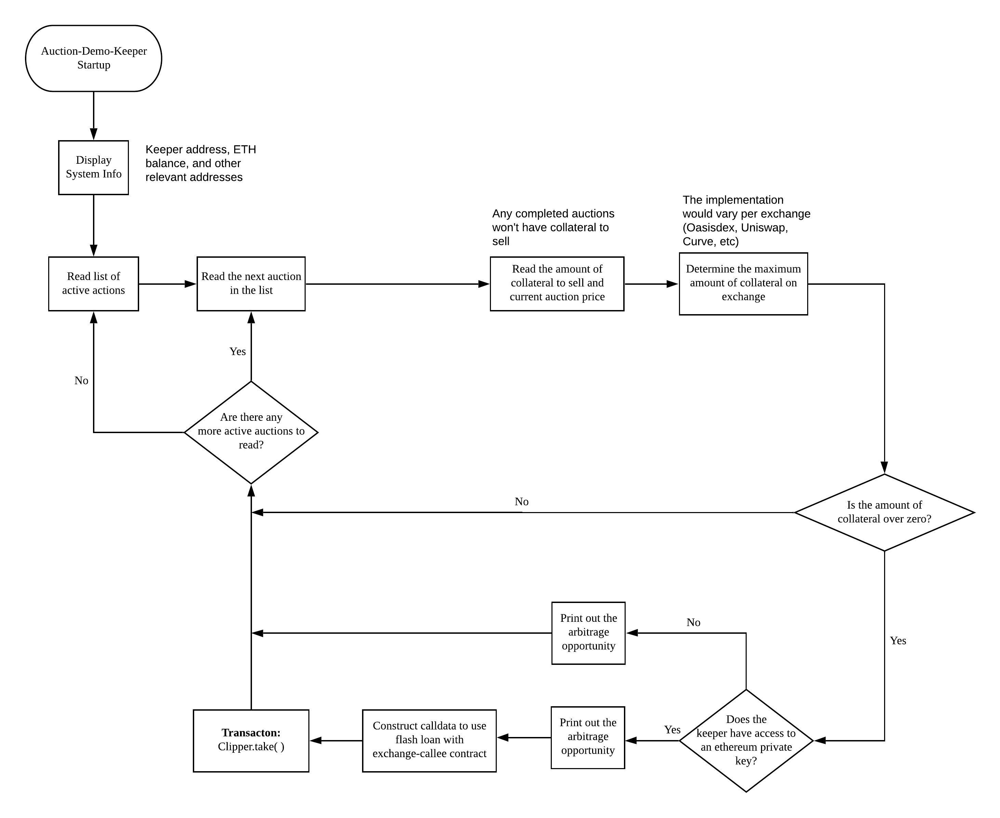

# Auction-Demo-Keeper

*Integration example of a LIQ2.0 Keeper with atomic swap functionality*

The Auction-Demo-Keeper is an integration example that demonstrates most ways to interact with the [LIQ-2.0]((https://forum.makerdao.com/t/liquidations-2-0-technical-summary/4632)) auction system in the Maker Protocol.
This "demo" keeper works out of the box, is simple in design, and leverages `clipper.take`'s [external call](https://github.com/makerdao/dss/blob/master/src/clip.sol#L394) feature, minimizing capital requirements.

By using an [exchange-callee](https://github.com/makerdao/exchange-callees) contract, `auction-demo-keeper` swaps auctioned collateral for DAI using a DEX, returning DAI to the auction to cover the bid, and collecting a DAI profit from the spread - all in a single transaction. The keeper needs only ETH for gas to participate in LIQ2.0 auctions.

## Scope

- It's an educational resource that'll help keeper operators transition their systems from LIQ1.2 to LIQ2.0
- Demonstrate novel, more capital efficient methods of LIQ2.0 participation
- An open source LIQ-2.0 Keeper that works out of the box

## Who's it for

- Beginner Keepers - Looking for lightweight tool to begin participating in liquidations
- Experienced Keepers - Interested in incorporating LIQ2.0 in their proprietary infrastructure

## Status
- As of March 23, the Auction Demo Keeper is still in active development, and is not yet fully functional.

## Operation Diagram



## Core Modules
### keeper.js

The Keeper module is the entry point for the Auction Demo Keeper. It is responsible for initializing the clipper and constructing the different exchange contracts e.g. Uniswap, Oasis
### clipper.js

The Clipper module is responsible for auction inititation. It listens for active auctions and gets the details of all active auctions. Based on the details of active auctions like collaterals remaining and auction state, the clipper executes the auction using the `Transact` Module.

### transact.js

The Transact module handles calculation of gas costs, signing and sending of transactions. It also has a major class called `GeometricGasPrice` which is used to get a geometric gas price that increases geometrically with respect to time and the fixed coefficient

## Installation

```bash
git clone https://github.com/makerdao/auction-demo-keeper.git
cd auction-demo-keeper
yarn install
```

## Configuring Keeper

### Setting up wallet

This keeper includes a test wallet already set up for testing purposes.  You'll want to replace this with your own wallet.   
You may use tools such as [MyCrypto.com](https://mycrypto.com/) to generate a new JSON wallet key and passphrase.

### Configuring in-place
Update `rpcUrl` in `config/mainnet.json` with the URL for your own Ethereum node. 
Edit `wallet/jsonpassword.txt` with your wallet password, and copy your JSON keystore file to `wallet/testwallet.json`.

### Configuring from environment
From your own startup script, export `AUCTION_DEMO_KEEPER_CONFIG` with the path to your JSON configuration file.
Export `AUCTION_DEMO_KEEPER_PASSWORD_PATH` and `AUCTION_DEMO_KEEPER_KEYSTORE_PATH` with paths to the appropriate files from your keystore.

### Configuration Parameters

- `rpcUrl` - rpcUrl stands for remote procedure call. This enables the keeper to connect to the  blockchain network  using the infura provider

- `MakerOTCSupportMethods` - This is the address of the helper contract for oasisDex

- `OasisDex` - This is the address of the oasis exchange contract

- `UniswapV2Router` - This is the address of uniswap v2 router contract

- `collateral` - This takes in an object for the collateral path "LINK-A" and "ETH-A"

- `txnReplaceTimeout` - Timeout in seconds for the transaction replacement 

- `delay` - Delay period in seconds

- `dynamicGasCoefficient` - This is a value that is needed to get a geometric gas price. It's default value is 1.125 (12.5%) which is the minimum increase for Parity to replace a transaction

- `maxGasPrice` - Max gas price that the geometric gas price calculator uses in wei

- `minProfitPercentage` - Minimum percentage arbitrage profits the Keeper should execute

## Generate Auctions

To generate auctions on a testnet, you need to run `scripts/create-auctions.js`. Before you do that howver, add:

- Private key in the script file
- Acquire tokens from the FAUCET contract

Then run `node scripts/create-auctions.js`

## How To Run

First, ensure your working directory is the root of this repository.

You may run with in-place configuration...
```bash
yarn run mainnet
```

...or with configuration from the environment:
```bash
yarn run env
```

## Local Testing

1 - Run testchain script: `yarn testchain`  
2 - In a separate shell, run JS unit tests: `yarn test`

## Disclaimer

YOU (MEANING ANY INDIVIDUAL OR ENTITY ACCESSING, USING OR BOTH THE SOFTWARE INCLUDED IN THIS GITHUB REPOSITORY) EXPRESSLY UNDERSTAND AND AGREE THAT YOUR USE OF THE SOFTWARE IS AT YOUR SOLE RISK. THE SOFTWARE IN THIS GITHUB REPOSITORY IS PROVIDED “AS IS”, WITHOUT WARRANTY OF ANY KIND, EXPRESS OR IMPLIED, INCLUDING BUT NOT LIMITED TO THE WARRANTIES OF MERCHANTABILITY, FITNESS FOR A PARTICULAR PURPOSE AND NONINFRINGEMENT. IN NO EVENT SHALL THE AUTHORS OR COPYRIGHT HOLDERS BE LIABLE FOR ANY CLAIM, DAMAGES OR OTHER LIABILITY, WHETHER IN AN ACTION OF CONTRACT, TORT OR OTHERWISE, ARISING FROM, OUT OF OR IN CONNECTION WITH THE SOFTWARE OR THE USE OR OTHER DEALINGS IN THE SOFTWARE. YOU RELEASE AUTHORS OR COPYRIGHT HOLDERS FROM ALL LIABILITY FOR YOU HAVING ACQUIRED OR NOT ACQUIRED CONTENT IN THIS GITHUB REPOSITORY. THE AUTHORS OR COPYRIGHT HOLDERS MAKE NO REPRESENTATIONS CONCERNING ANY CONTENT CONTAINED IN OR ACCESSED THROUGH THE SERVICE, AND THE AUTHORS OR COPYRIGHT HOLDERS WILL NOT BE RESPONSIBLE OR LIABLE FOR THE ACCURACY, COPYRIGHT COMPLIANCE, LEGALITY OR DECENCY OF MATERIAL CONTAINED IN OR ACCESSED THROUGH THIS GITHUB REPOSITORY.
